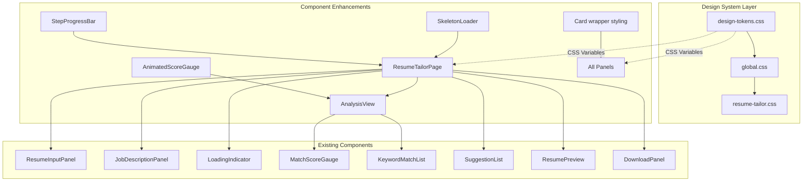
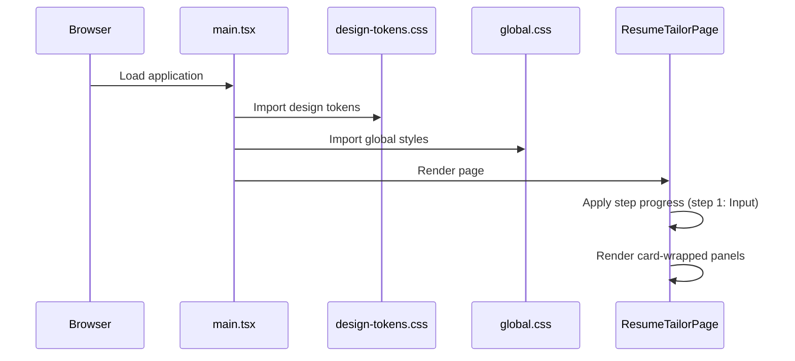
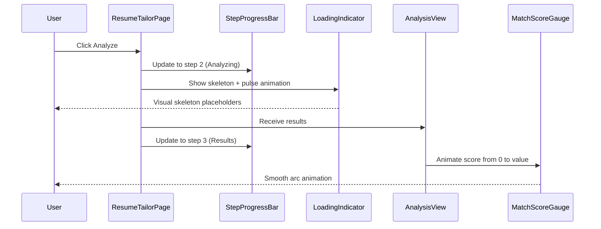

# Design Document: UI Improvement

## Overview

The Resume Tailor Tool currently uses inline styles across all components with no design system, no global stylesheet, and minimal visual hierarchy. This design introduces a modern, polished UI layer through a CSS design tokens system, glass-morphism card styling, smooth micro-animations, a step-progress indicator, improved typography, and enhanced visual feedback — all without changing the existing component architecture or backend logic.

The approach focuses on three pillars: (1) a design tokens + global stylesheet foundation, (2) component-level visual enhancements with cards, shadows, and transitions, and (3) workflow UX improvements including a progress stepper, animated score gauge, and skeleton loading states.

## Architecture



## Sequence Diagrams

### Page Load & Styling Flow



### Analysis Flow with Enhanced Feedback



## Components and Interfaces

### Component 1: Design Tokens (CSS Custom Properties)

**Purpose**: Centralized design system providing consistent colors, spacing, shadows, typography, and animations across all components.

**Interface**:
```typescript
// No TypeScript interface — pure CSS custom properties
// Consumed via var(--token-name) in CSS and inline styles
```

**Responsibilities**:
- Define color palette (primary, secondary, accent, semantic colors)
- Define spacing scale (4px base unit)
- Define typography scale (font sizes, weights, line heights)
- Define shadow elevations (sm, md, lg, xl)
- Define border radii (sm, md, lg, xl, full)
- Define transition/animation timing functions
- Support light theme (dark theme extensible via prefers-color-scheme)

### Component 2: StepProgressBar

**Purpose**: Visual workflow indicator showing the user's current position in the resume tailoring flow.

**Interface**:
```typescript
interface StepProgressBarProps {
  currentStep: number // 1-based index
  steps: StepDefinition[]
}

interface StepDefinition {
  label: string
  icon?: string // emoji or unicode character
}
```

**Responsibilities**:
- Display numbered steps with labels
- Highlight completed steps with checkmark
- Highlight current step with active styling
- Show connecting lines between steps with progress fill
- Responsive: collapse labels on mobile, show icons only

### Component 3: Enhanced LoadingIndicator (Skeleton State)

**Purpose**: Replace plain spinner with skeleton loading placeholders that mirror the layout of incoming content.

**Interface**:
```typescript
interface LoadingIndicatorProps {
  isLoading: boolean
  startTime?: number
  variant?: 'spinner' | 'skeleton' // new prop
}
```

**Responsibilities**:
- Show animated skeleton rectangles mimicking score gauge + keyword cards
- Maintain existing spinner + elapsed time display
- Add subtle pulse animation to skeleton elements
- Retain AI disclaimer text

### Component 4: Card Wrapper Pattern

**Purpose**: Consistent elevated card styling for all panel sections.

**Interface**:
```typescript
// Applied via CSS classes, no new component needed
// Classes: .card, .card--elevated, .card--interactive
```

**Responsibilities**:
- Provide consistent border-radius, shadow, padding
- Subtle hover elevation on interactive cards (suggestions)
- Smooth transition on focus/hover states

## Data Models

### Step Configuration

```typescript
type FlowStep = {
  id: FlowState
  label: string
  icon: string
  description: string
}

const FLOW_STEPS: FlowStep[] = [
  { id: 'input', label: 'Input', icon: '📝', description: 'Paste resume & job description' },
  { id: 'analyzing', label: 'Analyze', icon: '🔍', description: 'AI analysis in progress' },
  { id: 'results', label: 'Results', icon: '📊', description: 'Review match & suggestions' },
  { id: 'preview', label: 'Preview', icon: '👁', description: 'Review tailored resume' },
  { id: 'confirmed', label: 'Download', icon: '⬇', description: 'Download your resume' },
]
```

### Design Tokens Structure

```typescript
// Conceptual model — implemented as CSS custom properties
interface DesignTokens {
  colors: {
    primary: string        // #2563eb
    primaryHover: string   // #1d4ed8
    primaryLight: string   // #eff6ff
    secondary: string      // #7c3aed
    accent: string         // #06b6d4
    success: string        // #10b981
    warning: string        // #f59e0b
    error: string          // #ef4444
    surface: string        // #ffffff
    surfaceElevated: string // #ffffff
    background: string     // #f8fafc
    border: string         // #e2e8f0
    borderLight: string    // #f1f5f9
  }
  spacing: Record<string, string>  // 0-16 scale based on 4px
  shadows: {
    sm: string   // subtle cards
    md: string   // elevated cards
    lg: string   // modals/dropdowns
    xl: string   // floating elements
  }
  radii: {
    sm: string   // 6px - chips/badges
    md: string   // 10px - inputs
    lg: string   // 14px - cards
    xl: string   // 20px - large panels
    full: string // 9999px - pills
  }
  typography: {
    heading1: { size: string; weight: number; lineHeight: number }
    heading2: { size: string; weight: number; lineHeight: number }
    heading3: { size: string; weight: number; lineHeight: number }
    body: { size: string; weight: number; lineHeight: number }
    caption: { size: string; weight: number; lineHeight: number }
  }
}
```

## Algorithmic Pseudocode

### Step Progress Calculation

```typescript
function getStepIndex(flowState: FlowState): number {
  const mapping: Record<FlowState, number> = {
    input: 0,
    analyzing: 1,
    results: 2,
    applying: 2, // still on results step visually
    preview: 3,
    confirmed: 4,
  }
  return mapping[flowState]
}

function getStepStatus(stepIndex: number, currentIndex: number): 'completed' | 'active' | 'upcoming' {
  if (stepIndex < currentIndex) return 'completed'
  if (stepIndex === currentIndex) return 'active'
  return 'upcoming'
}
```

**Preconditions:**
- `flowState` is a valid FlowState enum value
- `stepIndex` and `currentIndex` are non-negative integers within FLOW_STEPS bounds

**Postconditions:**
- Returns exactly one of 'completed', 'active', 'upcoming'
- Steps before current are always 'completed'
- Exactly one step is 'active'

### Animated Score Counter

```typescript
function useAnimatedValue(target: number, duration: number = 1000): number {
  const [current, setCurrent] = useState(0)
  
  useEffect(() => {
    const startTime = performance.now()
    const startValue = 0
    
    function animate(now: number) {
      const elapsed = now - startTime
      const progress = Math.min(elapsed / duration, 1)
      // Ease-out cubic for smooth deceleration
      const eased = 1 - Math.pow(1 - progress, 3)
      const value = Math.round(startValue + (target - startValue) * eased)
      
      setCurrent(value)
      
      if (progress < 1) {
        requestAnimationFrame(animate)
      }
    }
    
    requestAnimationFrame(animate)
  }, [target, duration])
  
  return current
}
```

**Preconditions:**
- `target` is a number between 0 and 100
- `duration` is a positive number in milliseconds

**Postconditions:**
- Returns a value that smoothly transitions from 0 to `target`
- Animation completes within `duration` milliseconds
- Final value equals `target` exactly

**Loop Invariants:**
- `progress` is always in [0, 1]
- `current` is always in [0, target]

## Key Functions with Formal Specifications

### Function 1: StepProgressBar render

```typescript
function StepProgressBar({ currentStep, steps }: StepProgressBarProps): JSX.Element
```

**Preconditions:**
- `currentStep` is in range [0, steps.length - 1]
- `steps` has at least 2 elements
- Each step has a non-empty `label`

**Postconditions:**
- Renders `steps.length` step indicators
- Exactly one step has `aria-current="step"`
- Steps before `currentStep` show completed styling
- Connecting lines reflect progress percentage

### Function 2: applyCardStyles

```typescript
function getCardClassName(variant: 'default' | 'elevated' | 'interactive'): string
```

**Preconditions:**
- `variant` is one of the three valid values

**Postconditions:**
- Returns a valid CSS class string
- 'interactive' variant includes hover/focus transition classes
- All variants include base card styling (radius, padding, border)

### Function 3: Skeleton loading

```typescript
function SkeletonBlock({ width, height, rounded }: SkeletonProps): JSX.Element
```

**Preconditions:**
- `width` and `height` are valid CSS dimension strings or numbers
- `rounded` is optional boolean

**Postconditions:**
- Renders an animated placeholder block
- Animation is a subtle pulse (opacity 0.4 ↔ 1.0)
- Respects reduced-motion preference via `prefers-reduced-motion`

## Example Usage

```typescript
// design-tokens.css usage in components
// Before (inline style):
<div style={{ borderRadius: 8, boxShadow: '0 1px 3px rgba(0,0,0,0.1)' }}>

// After (CSS class):
<div className="card card--elevated">

// StepProgressBar in ResumeTailorPage
<StepProgressBar
  currentStep={getStepIndex(flowState)}
  steps={FLOW_STEPS}
/>

// Enhanced MatchScoreGauge with animation
const animatedScore = useAnimatedValue(overall, 1200)
<circle
  strokeDasharray={`${(animatedScore / 100) * arcLength} ${circumference}`}
/>

// Skeleton loading state
{isLoading && variant === 'skeleton' && (
  <div className="skeleton-grid">
    <SkeletonBlock width="200px" height="200px" rounded />
    <SkeletonBlock width="100%" height="24px" />
    <SkeletonBlock width="80%" height="24px" />
    <SkeletonBlock width="100%" height="120px" />
  </div>
)}
```

## Correctness Properties

*A property is a characteristic or behavior that should hold true across all valid executions of a system — essentially, a formal statement about what the system should do. Properties serve as the bridge between human-readable specifications and machine-verifiable correctness guarantees.*

### Property 1: Step status correctness

*For any* valid steps array (length >= 2) and any currentStep in [0, steps.length - 1], exactly one step is marked active (with aria-current="step") at the currentStep index, all steps with index less than currentStep display completed state, and all steps with index greater than currentStep display upcoming state.

**Validates: Requirements 3.2, 3.3, 3.4, 3.7**

### Property 2: Step count rendering

*For any* non-empty array of step definitions passed to StepProgressBar, the component renders exactly steps.length step indicator elements with their corresponding labels.

**Validates: Requirement 3.1**

### Property 3: Progress line proportionality

*For any* steps array and currentStep value, the connecting line fill percentage equals currentStep / (steps.length - 1) * 100, accurately reflecting workflow progress.

**Validates: Requirement 3.5**

### Property 4: Animated value bounds and convergence

*For any* target value in [0, 100], the useAnimatedValue hook produces values that are always integers in the range [0, target], starting at 0, monotonically non-decreasing, and converging to exactly the target value upon completion.

**Validates: Requirements 5.1, 5.3, 5.4**

### Property 5: Animation timing completion

*For any* target value in [0, 100] with the default 1200ms duration, the useAnimatedValue hook returns the exact target value after 1200 milliseconds have elapsed.

**Validates: Requirement 5.2**

### Property 6: Step index bounds safety

*For any* valid FlowState value, getStepIndex returns a value in [0, FLOW_STEPS.length - 1]. No flow state maps to an out-of-range index.

**Validates: Requirement 3.2**

## Error Handling

### Error Scenario 1: CSS Variable Not Supported

**Condition**: Very old browser without CSS custom property support
**Response**: All tokens include fallback values in the var() declaration: `var(--color-primary, #2563eb)`
**Recovery**: Components remain functional with hardcoded fallback colors

### Error Scenario 2: Animation Performance Issue

**Condition**: Low-end device or `prefers-reduced-motion: reduce` set
**Response**: All animations wrapped in `@media (prefers-reduced-motion: no-preference)` query
**Recovery**: Instant transitions replace animations; no layout shift

### Error Scenario 3: Step Index Out of Bounds

**Condition**: Invalid flowState passed to getStepIndex
**Response**: Clamp to valid range [0, steps.length - 1]
**Recovery**: Shows first or last step rather than crashing

## Testing Strategy

### Unit Testing Approach

- Test StepProgressBar renders correct number of steps
- Test step status calculation (completed/active/upcoming)
- Test getStepIndex mapping covers all FlowState values
- Test skeleton loader respects `variant` prop
- Test animated value hook reaches target value

### Property-Based Testing Approach

**Property Test Library**: fast-check (already installed)

- For any valid FlowState, getStepIndex returns a value within bounds
- For any score 0–100, animated gauge arc length is proportional to score
- For any step configuration, exactly one step is marked 'active'

### Integration Testing Approach

- Verify CSS variables are correctly applied by checking computed styles
- Verify step progress updates as user moves through the flow
- Verify skeleton disappears and content appears after loading completes
- Verify all interactive elements meet 44px minimum touch target

## Performance Considerations

- CSS-only animations (transforms, opacity) to stay on GPU compositor layer
- No JavaScript-driven layout animations — only requestAnimationFrame for number counting
- Skeleton loading prevents layout shift (CLS) by reserving exact space
- Design tokens are CSS variables — zero runtime cost, no JS bundle impact
- Card shadow transitions use `will-change: box-shadow` hint sparingly (only on hover-capable devices)

## Security Considerations

- No new data flows or API calls — purely presentational changes
- No third-party CSS or font CDN dependencies added
- All styling is local CSS — no injection vectors

## Dependencies

- No new npm packages required
- Uses existing CSS custom properties pattern already present in components
- Leverages existing `fast-check` for property-based tests
- All animations use native CSS transitions and `requestAnimationFrame`
